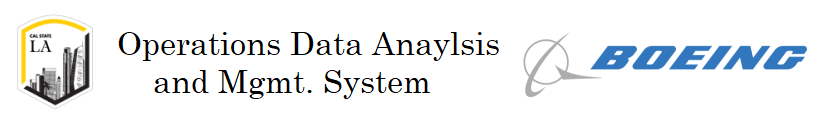

### Team

Role | Name | Github |
--- | --- | --- |
Advisor | Prof. Soo Lim | |
Liaison | Raymond (Ray) Hogan | |
Liaison | Sen Yao | |
Team Lead | Jesus R Mendoza | <div class="github">  [jesus-r-mendoza](https://github.com/jesus-r-mendoza) </div>
Head of Design | Maximilian H Orozco | <div class="github">  [maxorozco213](https://github.com/maxorozco213) </div>
Documentation Manager | Richard Balbuena | <div class="github">  [rbalbue](https://github.com/rbalbue) </div>
Quality Assurance | Nathan Lee | <div class="github">  [nlee806](https://github.com/nlee806) </div>


### Project Description

**ODAS** is an elaborate software suite that provides tons of functionality for handling large quantities of Telemetry, right out of the box!

As more and more satellites are launched into orbit, it is important to track of the status of each one. We're developing **ODAS**, with guidance from our **Boeing** liaisons, to function as a central hub which focuses on monitoring the Health and Status of your satellites. **ODAS** does so by analyzing the Health and Status Telemetry for each of your satellites, and providing powerful analytical tools, via a user-friendly Web interface, that allows any user or organization to monitor the state of their satellites. From the beginning we designed **ODAS** to be an ***Easy-to-Use*** system that deals with all of the dirty work for you, ranging from Fault Detection using Machine Learning to scalable storage solutions to manage millions of Telemetry data points.

### Project Overview

- **Frontend** [](#Team) [](#Team)
    - React JS
        - State managment w/ Redux
    - Plotly JS

- **Backend** [](#Team) [](#Team)
    - Django
    - MySql

- **Machine Learning** [](#Team) [](#Team)
    - Pandas, Numpy, SKLearn, Keras
    - Forecasting
        - Sliding Window w/ Classical Machine Learning Algorithms
            - Support Vector Regressor
            - Random Forest Tree Regressor
        - RNN
            - Long Short Term Memory

- **Containerized Application** [](#Team)
    - Docker
    - Docker-Compose

- **Amazon Web Services** [](#Team) [](#Team) [](#Team)
    - EC2 (Ubunutu Linux)
    - RDS MySql
    - S3 Buckets

---

### Clone our project repository
If you don't have the ODAS repository, clone it using:
```
$ git clone https://github.com/jesus-r-mendoza/Operations-Data-and-Mgmt-System.git
```
then, change directory into the repository's base directory using:
```
$ cd Operations-Data-and-Mgmt-System
```

## Running ODAS ( Linux : Ubuntu )

Because we often worked with Linux throughout the development of this project, we have written some convinient scripts to install all the dependencies, and run ODAS.

### Step 1
Make the launch script executable using this command:
```
chmod +x linux-install-and-run.sh
```
This will allow you to run this script via the terminal.

### Step 2
Run the script using this command:
```
./linux-install-and-run.sh
```

Now continue to **Step 5** of the next section to see details about accessing the running application.


## Running ODAS ( Windows / Mac )

### Step 1
Install Docker. To learn how to install docker click [here](https://www.docker.com/products/docker-desktop). You'll see a button to install Docker Desktop; you'll need to create an account with Docker Hub if you don't already have one. Also make sure you have docker-compose installed with it.

### Step 2
Install NodeJS for your system [here](https://nodejs.org/en/). Once the installation is complete, verify that you have access to the `npm` command on your terminal.

### Step 3
Install the `npm` package dependencies needed to run the ODAS frontend, using the following commands:

First, move to the `odas-ui/` directory using:
```
cd odas-ui/
```
Then install the dependencies with:
```
npm install
```

Once all the packages are installed, you're ready to run ODAS using the `docker-compose` command.

### Step 4
Once your in the base directory (`Operations-Data-and-Mgmt-System/`), simply run:
```
$ docker-compose up
```
NOTE: The first time you run this command, it will need to download the containers, this may take several minutes. Afterwards, the containers will automatically run since they have already been downloaded.

This will run both the frontend and backend containers.

---

### Step 5

For testing purposes, the backend container is accessible through your container's ip or localhost at port 8080; and the frontend container is accessible through your container's ip or localhost at port 3000.

Once the containers are running on your local machine, you should be able to see the running application via this link [http://localhost:3000/](http://localhost:3000)

### Step 6

Now that ODAS is running on your local machine using the default configuration settings, you can use some of the functionality with the example user we provided. Because the public configurations require that you connect to a database on your local machine, we have also provided a `db.sqlite3` file to get you started with sample data, users, and organizations.

You can Sign In with the following pre-registered User:

```
username:  joe
password:  password123
```

The User `joe` is part of the `CSULA` organization, which has one satellite to its name: `CubeSat`. `CubeSat` has two existing components that you'll be able to query data from to see the graphing functionality. They are the `Battery` and `CPU` components.

Feel free to create new Users and join the `CSULA` organization using the invite code: `3MbRJyt26Kyu>`

Or additionally, you can create new Organizations (for active Users that have not joined any organization yet). To create a new Organizaiton (and automatically join it), you'll be prompted to provide a password. This was a feature we included to restrict who could create Organizations during the time that ODAS was available to the public. Since you're using the default public configuration, simply provide the following when creating a new Organization:
```
organization name:  <your org name>
password:           password123
```

Now, you should have access to most of the features provided by ODAS. Obviously, some features are not available because they require the FULL configuration file that is only available to the original ODAS developers. Nonetheless, it should give you a good sense of ODAS' capabalities.